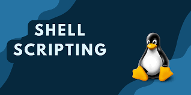

#  MEDS Training Repository

Welcome to my MEDS Training GitHub Repository!  
This repository contains all exercises, tutorials, and progress for the training program.

---

##  Table of Contents
- [MEDS Training Repository](#meds-training-repository)
  - [Table of Contents](#table-of-contents)
  - [📋 Completed Topics Checklist](#-completed-topics-checklist)
  - [🖼️ Center Aligned Figures](#️-center-aligned-figures)
  - [📜 Shell Scripting Tutorial](#-shell-scripting-tutorial)
    - [📘 What is Shell Scripting?](#-what-is-shell-scripting)
    - [✍️ How to Create a Shell Script](#️-how-to-create-a-shell-script)
    - [🛠️ Examples of Shell Scripts](#️-examples-of-shell-scripts)
    - [Important Shell Scripting Concepts](#important-shell-scripting-concepts)
    - [Mini Practice Challenge](#mini-practice-challenge)
    - [Contact](#contact)

---

## 📋 Completed Topics Checklist

- [x] Git and GitHub Basics
- [x] Markdown Essentials
- [x] Centering Images in Markdown
- [x] Shell Scripting Fundamentals
- [x] Vim Editor
- [x] Bash Commands and operators

---

## 🖼️ Center Aligned Figures

<p align="center">
  
</p>

---

## 📜 Shell Scripting Tutorial

### 📘 What is Shell Scripting?

Shell scripting is the process of writing a series of commands for the Unix/Linux shell to automate tasks.

---

### ✍️ How to Create a Shell Script

1. Open your terminal.
2. Create a new file:
   ```bash 
   nano myscript.sh

3. Add a shebang line and some commands:
   ```bash
     #!/bin/bash
    echo "Hello, World!"
  
4. Save and exit (CTRL+O, ENTER, CTRL+X).
5. Make the script executable:
   ```bash
   chmod +x myscript.sh

6. Run the script:
   ```bash
   ./myscript.sh

7. Output:
   ```bash
   Hello, World!"
   ```

### 🛠️ Examples of Shell Scripts

✍️ Example 1: Simple Hello World
zz
```bash
#!/bin/bash
echo "Hello, World!"
```

✍️ Example 2: Adding Two Numbers

```bash
#!/bin/bash

echo "Enter first number:"
read num1

echo "Enter second number:"
read num2

sum=$((num1 + num2))
echo "The sum of $num1 and $num2 is: $sum"
```

✍️ Example 3: Check if a Number is Even or Odd

```bash
#!/bin/bash

echo "Enter a number:"
read num

if [ $((num % 2)) -eq 0 ]; then
    echo "The number $num is even."
else
    echo "The number $num is odd."
fi
```
### Important Shell Scripting Concepts

1. Variables: Variables are used to store values that can be used throughout the script.

```bash
my_variable="Hello"
echo $my_variable
```

2. User Input: You can ask the user for input using the read command.

```bash
echo "What's your name?"
read name
echo "Hello, $name!"
```

3. Conditionals (if-else): This allows your script to make decisions based on conditions.

```bash
if [ $num -gt 10 ]; then
    echo "The number is greater than 10."
else
    echo "The number is 10 or less."
fi
```

4. Loops: You can use loops to repeat tasks. Example with a for loop:

```bash
for i in {1..5}
do
    echo "Loop iteration: $i"
done
```

### Mini Practice Challenge

Task: Write a script that:

    Asks for the user’s name.

    Asks for their favorite color.

    Prints a message saying "Hello, [name]! [color] is a great choice

```bash
#!/bin/bash

echo "What is your name?"
read name

echo "What is your favorite color?"
read color

echo "Hello, $name! $color is a great choice!"
```


### Contact

- Name : Umair Nadeem
- GitHub : https://github.com/Umairndm
- Gmail : nadeemumair216@gmail.com
  


  


